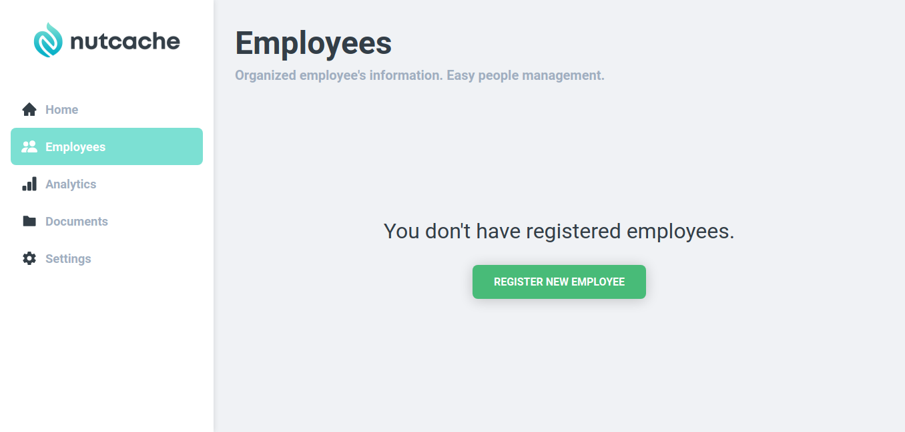
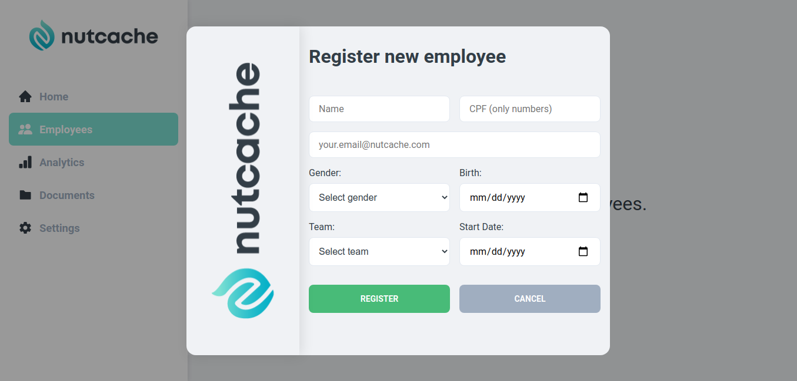
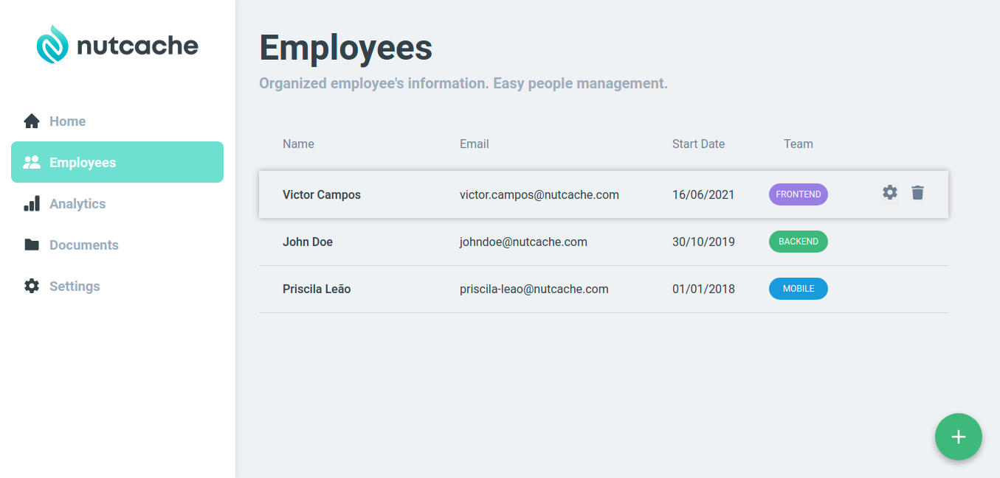

<p align="center">
  
</p>


<h1 align="center">
  Nutcache
</h1>

<p align="center">
  Aplicação para gestão de pessoal da Nutcache. Para organizar as informações de seus funcionários.
</p>

<p align="center">
  
  <a href="https://opensource.org/licenses/MIT">
    
  </a>
</p>

<div>
  
</div>
<div>
  
</div>
<div>
  
</div>

<hr />

## Tecnologias
Esse projeto foi construído visando a prática das tecnologias mais avançadas do mercado para construção de interfaces. 

- **React** — Uma biblioteca JavaScript para construção de interfaces de usuários modernas e escaláveis.
- **TypeScript** — Um superset JavaScript para facilitar a manutenção do código.
- **Styled Components** — Um biblioteca avançada para criação de estilos de fácil manutenção. 

## Como utilizar:
Você precisa ter instalado na sua máquina o [Node.js](https://nodejs.org/en/) para poder rodar o projeto.
   
### Passos:

##### 1. Clone o repositório.

```
  $ git clone https://github.com/viictorcamposs/nutcache-challenge-victorCampos
```

##### 2. No seu terminal, instale os pacotes necessários.

```
  # Rode o comando dentro da pasta que você clonou a aplicação
  
  $ yarn
  ou
  $ npm install
```

##### 3. Inicie o servidor que irá servir os dados da api

```
  # Abra um novo terminal
  # Vá até a pasta que você clonou a api que vai servir o front-end
  # Link da API: https://github.com/viictorcamposs/nutcache-challenge-api-victorCampos
  # Com todas as dependências instaladas, rode o comando:

  $ yarn dev
  ou
  $ npm run dev
```

##### 4. Com o servidor da api ligado, inicie o aplicativo em desenvolvimento e aguarde carregar a página.

```
  $ yarn start
```
ou
```
  $ npm run start
```
##### 6. Caso seu aplicativo não abra automaticamente, abra seu navegador. O projeto vai estar disponível em <a href="http://localhost:3000">http://localhost:3000/</a>


## Licença

Este projeto está sob licença MIT - veja a página de [LICENÇA](https://opensource.org/licenses/MIT) para mais detalhes.
